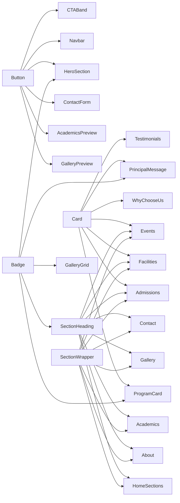

# Little Gems School Component Graph

## Overview
The project follows a content-driven component model:
- `app/` routes compose sections and UI blocks
- `components/layout/` provides persistent shell
- `components/sections/` provides feature sections
- `components/ui/` provides reusable building blocks
- `data/` drives copy, image paths, navigation, and structured content

## Route to Component Mapping

```mermaid
flowchart TD
  RootLayout["src/app/layout.tsx"] --> Navbar["layout/Navbar"]
  RootLayout --> Footer["layout/Footer"]
  RootLayout --> GlobalWhatsApp["components/WhatsAppButton"]
  RootLayout --> Schema["components/SchemaOrg"]
  RootLayout --> PageSlot["Route content"]

  Home["app/page.tsx"] --> AdmissionsStrip["layout/AdmissionsStrip"]
  Home --> Hero["sections/HeroSection"]
  Home --> Why["sections/WhyChooseUs"]
  Home --> AcademicPreview["sections/AcademicsPreview"]
  Home --> FacilitiesGrid["sections/FacilitiesGrid"]
  Home --> GalleryPreview["sections/GalleryPreview"]
  Home --> Testimonials["sections/TestimonialCarousel"]
  Home --> FAQ["sections/FAQAccordion"]
  Home --> CTAHome["sections/CTABand"]

  About["app/about/page.tsx"] --> SectionHeading
  About --> Card
  About --> Principal["sections/PrincipalMessage"]
  About --> CTAAbout["sections/CTABand"]

  Academics["app/academics/page.tsx"] --> SectionHeading
  Academics --> Card
  Academics --> ProgramCard
  Academics --> CTAAcademics["sections/CTABand"]

  Admissions["app/admissions/page.tsx"] --> SectionHeading
  Admissions --> Card
  Admissions --> ContactForm
  Admissions --> CTAAdmissions["sections/CTABand"]

  Facilities["app/facilities/page.tsx"] --> SectionHeading
  Facilities --> Card
  Facilities --> CTAFacilities["sections/CTABand"]

  Gallery["app/gallery/page.tsx"] --> GalleryGrid["ui/GalleryGrid"]
  Gallery --> CTAGallery["sections/CTABand"]

  Events["app/events/page.tsx"] --> SectionHeading
  Events --> Card
  Events --> CTAEvents["sections/CTABand"]

  Contact["app/contact/page.tsx"] --> SectionHeading
  Contact --> Card
  Contact --> ContactForm
  Contact --> CTAContact["sections/CTABand"]
```

## Reusable UI Primitive Graph

## Data Dependency Graph

```mermaid
flowchart TD
  School["data/school.ts"] --> Navbar
  School --> Footer
  School --> AdmissionsStrip
  School --> HeroSection
  School --> WhyChooseUs
  School --> AcademicsPreview
  School --> FacilitiesGrid
  School --> GalleryPreview
  School --> TestimonialsSection["TestimonialCarousel"]
  School --> FAQSection["FAQAccordion"]
  School --> PrincipalMessage
  School --> AdmissionsPage
  School --> FacilitiesPage
  School --> EventsPage
  School --> ContactPage
  School --> MetadataUtil["lib/metadata.ts"]

  Programs["data/programs.ts"] --> ProgramCard
  Programs --> AcademicsPreview
  Programs --> AcademicsPage

  FacilitiesData["data/facilities.ts"] --> FacilitiesGrid
  FacilitiesData --> FacilitiesPage

  GalleryData["data/gallery.ts"] --> GalleryPreview
  GalleryData --> GalleryGrid
  GalleryData --> GalleryPage

  FAQs["data/faqs.ts"] --> FAQAccordion
  Testimonials["data/testimonials.ts"] --> TestimonialCarousel
  Navigation["data/navigation.ts"] --> Navbar
  Navigation --> Footer
```

## Special Notes
- The app is intentionally data-led; content changes usually belong in `src/data/` rather than inside page JSX.
- `src/lib/metadata.ts` exists but the route files currently define metadata inline instead of reusing it.
- `src/components/layout/WhatsAppButton.tsx` and `src/components/ui/GoogleMap.tsx` appear to be legacy/unused because the app now uses `src/components/WhatsAppButton.tsx` and an inline iframe on the contact page.

## Dependency Hotspots
- `src/data/school.ts` is the most critical content dependency in the project.
- `src/app/layout.tsx` is the global shell dependency for SEO, schema, nav, footer, and fonts.
- `src/components/ui/ContactForm.tsx` + `src/app/api/enquiry/route.ts` form the only dynamic lead-capture workflow in the current site.
