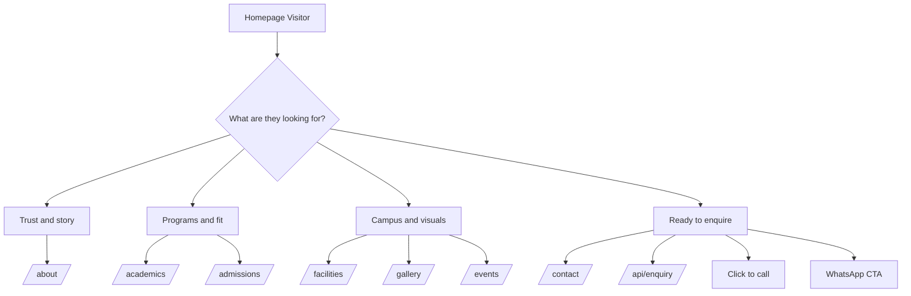

# Little Gems School Site Map

## Public Routes

### `/`
Purpose: Primary landing page and lead-generation funnel.

Sections:
- AdmissionsStrip
- HeroSection
- WhyChooseUs
- AcademicsPreview
- FacilitiesGrid
- GalleryPreview
- TestimonialCarousel
- FAQAccordion
- CTABand

Primary CTAs:
- `Apply Now` -> `/admissions`
- `Book a School Visit` -> `/contact`
- Section-level buttons to academics, facilities, gallery
- Floating WhatsApp button on all pages

### `/about`
Purpose: Build trust through story, values, and leadership messaging.

Sections:
- Hero-style intro section
- Our Story
- Vision
- Mission
- Principal Message
- Core Values
- CTA band

Primary CTA:
- `Plan a Visit` -> `/contact`

### `/academics`
Purpose: Help families understand teaching philosophy and program fit.

Sections:
- Hero-style intro section
- Teaching Philosophy
- Program details
- Co-curricular grid
- CTA band

Primary CTA:
- CTA band defaults to admissions path

### `/admissions`
Purpose: Main conversion page for enquiries and admission guidance.

Sections:
- Hero-style intro section
- Admissions status banner
- Eligibility table
- Documents checklist
- 5-step admission process
- Enquiry form
- CTA band

Primary CTA flow:
- Form submission -> `/api/enquiry`
- CTA band phone call
- Navbar/WhatsApp access

### `/facilities`
Purpose: Reassure parents about the campus environment and safety.

Sections:
- Hero-style intro section
- Facilities card grid
- Safety section
- CTA band

Primary CTA:
- `Schedule a Visit` -> `/contact`

### `/gallery`
Purpose: Visual social proof and engagement.

Sections:
- Hero-style intro section
- Filterable gallery grid with lightbox
- CTA band

Primary CTA:
- `Book a Visit` -> `/contact`

### `/events`
Purpose: Show school activity calendar, notices, and year-round engagement.

Sections:
- Hero-style intro section
- Upcoming events cards
- Notice board
- Academic calendar
- CTA band

Primary CTA:
- `Contact School` -> `/contact`

### `/contact`
Purpose: Direct response page for parents ready to talk or visit.

Sections:
- Hero-style intro section
- Contact info cards
- ContactForm
- Embedded Google Map
- CTA band

Primary CTA flow:
- Form submission -> `/api/enquiry`
- Direct call from phone card
- Google Maps visit intent
- WhatsApp floating button

### `/_not-found`
Purpose: Recover users who hit broken or outdated links.

CTAs:
- `Back to Homepage`
- `Contact School`

## Global Navigation
- About
- Academics
- Admissions
- Facilities
- Gallery
- Events
- Contact

Persistent actions:
- Phone number click-to-call
- `Enquire Now`
- WhatsApp floating button

## Footer Navigation
- Home
- About
- Academics
- Admissions
- Facilities
- Gallery
- Events
- Contact

## CTA Flow Summary

## Intended User Funnel
- Awareness: homepage, gallery, about
- Consideration: academics, facilities, events
- Conversion: admissions, contact, phone, WhatsApp, enquiry form
